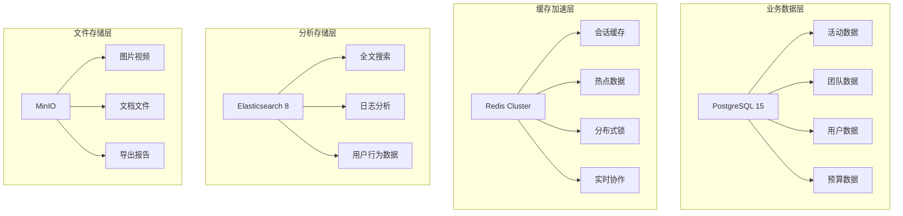

# 数据库管理员产出 - 团建助手 (Database Administrator Output - Team Building Assistant)

**数据库管理员（DBA）输出文档**

## 1. 数据库架构设计概述 (Database Architecture Overview)

### 1.1 数据存储策略

团建助手系统采用多模态数据存储架构，针对不同数据特性选择最适合的数据库技术：



### 1.2 数据库选型理由

| 数据库类型 | 选择理由 | 适用场景 |
|------------|----------|----------|
| **PostgreSQL 15** | - ACID事务支持完善<br>- JSONB原生支持<br>- 窗口函数和CTE强大<br>- 扩展丰富(PostGIS,pg_partman) | 核心业务数据存储 |
| **Redis Cluster** | - 内存级性能<br>- 发布订阅功能<br>- 原子操作支持<br>- 数据过期机制 | 会话管理、缓存、分布式锁 |
| **Elasticsearch 8** | - 全文搜索能力<br>- 近实时搜索<br>- 聚合分析功能<br>- 水平扩展能力 | 活动搜索、日志分析、用户行为 |
| **MinIO** | - S3 API兼容<br>- 高性能对象存储<br>- 分布式架构<br>- 数据持久性 | 文件存储、媒体资源、备份数据 |

## 2. PostgreSQL集群设计 (PostgreSQL Cluster Design)

### 2.1 高可用架构设计

#### 2.1.1 Patroni集群方案

```yaml
# Patroni配置文件
bootstrap:
  dcs:
  # DCS (Distributed Configuration Store) 配置
    ttl: 30
    loop_wait: 10
    retry_timeout: 10
    maximum_lag_on_failover: 1048576
    postgresql:
      use_pg_rewind: true
      use_slots: true
      parameters:
        # 性能优化参数
        max_connections: 200
shared_buffers: 256MB
        effective_cache_size: 2GB
      work_mem: 4MB
        maintenance_work_mem: 64MB
      wal_buffers: 16MB
        checkpoint_completion_target: 0.9
        wal_compression: on
    random_page_cost: 1.1
        effective_io_concurrency: 200
default_statistics_target: 100
        # 复制相关参数
        wal_level: replica
        hot_standby: on
        max_wal_senders: 10
     max_replication_slots: 10
 hot_standby_feedback: on
    # 一致性保障
        synchronous_commit: on
        synchronous_standby_names: "*"

  # 初始化数据库
  initdb:
  - encoding: UTF8
    - locale: en_US.UTF-8
    - data-checksums

  pg_hba:
  - hostssl all all 0.0.0.0/0 md5
    - hostssl all all ::0/0 md5
  - host all all 127.0.0.1/32 trust

postgresql:
  authentication:
replication:
      username: replicator
  password: "{{env `PATRONI_REPLICATION_PASSWORD`}}"
        superuser:
          postgres:
  username: postgres
     password: "{{env `POSTGRES_PASSWORD`}}"
    parameters:
      unix_socket_directories: '.'
      port: 5432
    recovery_conf:
      restore_command: "/usr/bin/envdir /etc/wal-g.d/env /usr/local/bin/wal-g wal-fetch %f %p"
  # 备用服务器配置
 standby_cluster:
      host: master.te-building-postgresql-r.supplyDemand.com
        port: 5432
primary_slot_name: standby_slot

# 集群成员配置100
scope: team-building-postgres-cluster
name: postgresql-{{ .Values.replicaIndex }}

restapi:
  listen: 0.0.0.0:8008
  connect_address: postgresql-{{ .Values.replicaIndex }}.te-building-postgresql-r.supplyDemand.com:8008

etcd:
  hosts:
  - etcd-0.team-building-etcd:2379
    - etcd-1.team-building-etcd:2379
    - etcd-2.team-building-etcd:2379

# WAL-G备份配置 (高级特性)
it 'backup'
    create_replica_method:
 - wal_g
    wal_g:
      command: "/usr/local/scripts/wal_g_backup.sh"
      no_master: 1
      no_params: true
      keep_data: false
      running_timeout: 3600
      recovery_conf:
      restore_command: "/usr/bin/envdir /etc/wal-g.d/env /usr/local/bin/wal-g wal-fetch %f %p"
```

#### 2.1.2 pgBouncer连接池配置

```ini
# pgBouncer配置 - 连接池管理
[databases]
team_building_primary = host=postgresql-primary port=5432 dbname=team_building
 team_building_standby = host=postgresql-standby port=5432 dbname=team_building
team_building_pool = host=postgresql-pool port=5432 dbname=team_building

[pgbouncer]
# 基本参数
listen_addr = 0.0.0.0
listen_port = 6432
auth_type = md5
auth_file = /etc/pgbouncer/userlist.txt

# 连接池参数
pool_mode = transaction
max_client_conn = 300
default_pool_size = 50
min_pool_size = 15
reserve_pool_size = 5
reserve_pool_timeout = 3

# 查询日志和统计
stats_users = stats, monitor
log_connections = 1
log_disconnections = 1
log_pooler_stats = 1
stats_period = 60

# 查询限制
max_prepared_statements = 100
ignore_startup_parameters = extra_float_digits

# 超时设置
server_check_query = select 1
server_check_delay = 30
server_lifetime = 3600
server_idle_timeout = 600

# 高级特性
application_name_add_host = 1
max_user_connections = 30
conffile = /etc/pgbouncer/pgbouncer.ini
```

### 2.2 分片策略设计

#### 2.2.1 业务数据分片策略

基于业务特性，我们采用以下分片策略：

```sql
-- 分片策略定义
CREATE EXTENSION IF NOT EXISTS "uuid-ossp";
CREATE EXTENSION IF NOT EXISTS "pg_partman";

-- 按团队ID分片的活动表分区
CREATE TABLE partitioned_activities (
    id UUID DEFAULT uuid_generate_v4() PRIMARY KEY,
    team_id UUID NOT NULL,
 title VARCHAR(200) NOT NULL,
  status activity_status NOT NULL,
  created_at TIMESTAMP WITH TIME ZONE DEFAULT NOW(),
    updated_at TIMESTAMP WITH TIME ZONE DEFAULT NOW()
) PARTITION BY HASH (team_id);

-- 创建16个分区（按团队ID哈希）
CREATE TABLE partitioned_activities_p00 PARTITION OF partitioned_activities
FOR VALUES WITH (MODULUS 16, REMAINDER 0);
CREATE TABLE partitioned_activities_p01 PARTITION OF partitioned_activities
    FOR VALUES WITH (MODULUS 16, REMAINDER 1);
-- ... 继续创建p02到p15
```

#### 2.2.2 时间分区表设计

对于时间相关的数据，采用分区优化：

```sql
-- 按月份分区的反馈数据表
CREATE TABLE partitioned_feedback (
    id BIGSERIAL PRIMARY KEY,
    activity_id UUID NOT NULL,
    user_id UUID NOT NULL,
  rating INTEGER CHECK (rating BETWEEN 1 AND 5),
    comment TEXT,
    created_at TIMESTAMP WITH TIME ZONE DEFAULT NOW()
) PARTITION BY RANGE (created_at);

-- 自动分区管理（使用pg_partman）
SELECT create_parent('public.partitioned_feedback', 'created_at', 'partman', 'monthly', p_premake=>3);

-- 查看分区信息
SELECT partman.show_partition_name('public.partitioned_feedback');
SELECT partman.show_partition_info('public.partitioned_feedback');
```

### 2.3 性能优化策略

#### 2.3.1 数据库性能参数调优

```sql
-- PostgreSQL性能参数Configuration
ALTER SYSTEM SET max_connections = 200;
ALTER SYSTEM SET shared_buffers = '256MB';
ALTER SYSTEM SET effective_cache_size = '1GB';
ALTER SYSTEM SET work_mem = '4MB';
ALTER SYSTEM SET maintenance_work_mem = '64MB';
ALTER SYSTEM SET checkpoint_completion_target = 0.9;
ALTER SYSTEM SET wal_buffers = '16MB';
ALTER SYSTEM SET default_statistics_target = 100;
ALTER SYSTEM SET random_page_cost = 1.1;
ALTER SYSTEM SET effective_io_concurrency = 200;
-- 并行查询
ALTER SYSTEM SET max_parallel_workers_per_gather = 4;
ALTER SYSTEM SET max_parallel_workers = 8;
ALTER SYSTEM SET max_parallel_maintenance_workers = 4;
-- 自动vacuum调优
ALTER SYSTEM SET autovacuum_vacuum_scale_factor = 0.2;
ALTER SYSTEM SET autovacuum_analyze_scale_factor = 0.1;
ALTER SYSTEM SET autovacuum_vacuum_threshold = 50;
ALTER SYSTEM SET autovacuum_analyze_threshold = 50;
-- 连接池优化
ALTER SYSTEM SET max_prepared_transactions = 100;
ALTER SYSTEM SET idle_in_transaction_session_timeout = '30min';
SELECT pg_reload_conf();
```

#### 2.3.2 查询优化和索引策略

```sql
-- 重点表索引优化策略

-- 1. 活动表核心索引
CREATE INDEX CONCURRENTLY IF NOT EXISTS idx_activities_team_date_status
ON activities (team_id, created_at DESC, status)
WHERE status IN ('APPROVED', 'IN_PROGRESS', 'COMPLETED');

CREATE INDEX CONCURRENTLY IF NOT EXISTS idx_activities_search
ON activities USING gin(to_tsvector('english', title || ' ' || coalesce(description, '')));

-- 2. 参与者表优化索引
CREATE INDEX CONCURRENTLY IF NOT EXISTS idx_activity_participants_activity_user
ON activity_participants (activity_id, user_id)
WHERE status = 'CONFIRMED';

CREATE INDEX CONCURRENTLY IF NOT EXISTS idx_activity_participants_user_status
ON activity_participants (user_id)
WHERE status IN ('INVITED', 'CONFIRMED');

-- 3. 团队表复合索引
CREATE INDEX CONCURRENTLY IF NOT EXISTS idx_teams_org_active
ON teams (organization_id, is_active)
WHERE is_active = true;

-- 4. 预算表范围索引
CREATE INDEX CONCURRENTLY IF NOT EXISTS idx_budgets_activity_amount
ON budgets (activity_id, total_amount, used_amount)
WHERE status != 'DISABLED';

-- 5. 用户行为追踪索引
CREATE INDEX CONCURRENTLY IF NOT EXISTS idx_user_activities_behavior
ON user_activities (user_id, activity_type, created_at DESC);

-- 6. 全文搜索专用索引
CREATE INDEX CONCURRENTLY IF NOT EXISTS idx_activities_full_text
ON activities USING gin(to_tsvector('english',
    coalesce(title,'') || ' ' ||
    coalesce(location,'') || ' ' ||
    coalesce(description,'')
));
```

#### 2.3.3 复杂查询性能优化

```sql
-- 复杂查询优化示例
-- 原始查询：获取团队活动和统计信息
EXPLAIN (ANALYZE, BUFFERS) WITH team_stats AS (
    SELECT
        t.id as team_id,
   count(a.id) as total_activities,
        avg(f.avg_rating) as avg_satisfaction_score
    FROM teams t
    LEFT JOIN activities a ON t.id = a.team_id AND a.status = 'COMPLETED'
LEFT JOIN feedbacks f ON a.id = f.activity_id
    WHERE t.organization_id = $uuid
      AND t.is_active = true
 GROUP BY t.id
),
recent_activities AS (
    SELECT
   t.id as team_id,
     a.id as activity_id,
        a.title,
   a.scheduled_date,
        a.participants_count,
   f.avg_rating
    FROM teams t
    JOIN activities a ON t.id = a.team_id
  LEFT JOIN (
        SELECT activity_id, AVG(rating) as avg_rating
   FROM feedbacks
     GROUP BY activity_id
    ) f ON a.id = f.activity_id
    WHERE t.organization_id = $uuid
      AND t.is_active = true
        AND a.created_at > NOW() - INTERVAL '90 days'
    ORDER BY a.created_at DESC
)
SELECT
    ts.*,
    json_agg(ra) FILTER (WHERE ra.activity_id IS NOT NULL) as recent_activities
FROM team_stats ts
LEFT JOIN recent_activities ra ON ts.team_id = ra.team_id
ORDER BY ts.avg_satisfaction_score DESC;

-- 优化后的查询（使用CTE和合适的索引）
EXPLAIN (ANALYZE, BUFFERS) WITH team_stats AS (
    SELECT
        t.id as team_id,
 count(a.id) as total_activities,
    AVG(f.avg_rating) as avg_satisfaction_score
 FROM teams t
 LEFT JOIN LATERAL (
     SELECT a.id
     FROM activities a
            WHERE a.team_id = t.id
       AND a.status = 'COMPLETED'
   ) a ON true
    LEFT JOIN LATERAL (
     SELECT AVG(rating) as avg_rating
     FROM feedbacks f
            WHERE f.activity_id = a.id
        ) f ON true
    WHERE t.organization_id = $uuid
 AND t.is_active = true
    GROUP BY t.id
),
recent_activities AS (
    SELECT
     t.id as team_id,
        a.id as activity_id,
   a.title,
        a.scheduled_date,
        a.participants_count,
    f.avg_rating
    FROM teams t
    INNER JOIN activities a ON t.id = a.team_id
    LEFT JOIN LATERAL (
   SELECT AVG(rating) as avg_rating
            FROM feedbacks f
WHERE f.activity_id = a.id
          ) f ON true
 WHERE t.organization_id = $uuid
      AND t.is_active = true
        AND a.created_at > NOW() - INTERVAL '90 days'
    ORDER BY a.created_at DESC
  LIMIT 100  -- 限制结果集大小
)
SELECT
    ts.*,
    coalesce(
  json_agg(json_build_object(
             'activity_id', ra.activity_id,
         'title', ra.title,
          'scheduled_date', ra.scheduled_date,
      'participants_count', ra.participants_count,
    'avg_rating', ra.avg_rating
            )) FILTER (WHERE ra.activity_id IS NOT NULL), '[]'
    ) as recent_activities
FROM team_stats ts
LEFT JOIN recent_activities ra ON ts.team_id = ra.team_id
ORDER BY COALESCE(ts.avg_satisfaction_score, 0) DESC;
```

## 3. Redis缓存体系设计 (Redis Cache System Design)

### 3.1 缓存策略设计

#### 3.1.1 多级缓存架构

```python
# 缓存层级定义
CACHE_LEVELS = {
    'L1': {
        'cache_type': 'local_caffeine',
        'ttl': 10,  # 10秒
   'max_size': 1000,
        'description': '应用本地缓存'
    },
    'L2': {
        'cache_type': 'redis_cluster',
        'ttl': 300,  # 5分钟
        'max_size': 10000,
 'description': '分布式Redis缓存'
    },
    'L3': {
        'cache_type': 'persisted_storage',
        'ttl': 86400,  # 24小时
        'description': '持久化存储'
    }
}

# 缓存策略应用
EXPIRATION_POLICIES = {
    'session_data': 1800,      # 30分钟
    'activity_cache': 600,     # 10分钟
    'ai_recommendation': 14400, # 4小时
    'user_privileges': 3600,   # 1小时
    'statistics_cache': 1800,  # 30分钟
    'team_profile': 7200,      # 2小时
}
```

#### 3.1.2 Redis集群配置

```yaml
# Redis Cluster配置
apiVersion: v1
kind: ConfigMap
metadata:
  name: redis-cluster-config
data:
  redis.conf: |
    # 基本设置
 port 6379
    tcp-backlog 511
timeout 30
tcp-keepalive 60
    loglevel notice
  logfile ""
  databases 16

    # 内存策略
    maxmemory 512mb
maxmemory-policy allkeys-lru
maxmemory-samples 5

    # AOF策略
    appendonly yes
    appendfilename "appendonly.aof"
appendfsync everysec
    no-appendfsync-on-rewrite no
auto-aof-rewrite-percentage 100
    auto-aof-rewrite-min-size 64mb

# RDB策略
 save 900 1
    save 300 10
    save 60 10000
 stop-writes-on-bgsave-error yes
  rdbcompression yes
  rdbchecksum yes

    # 集群设置
    cluster-enabled yes
    cluster-config-file nodes.conf
    cluster-node-timeout 5000
   cluster-replica-validity-factor 10
    cluster-migration-barrier 1

    # 慢查询日志
    slowlog-log-slower-than 10000
    slowlog-max-len 128

    # 集群客户端配置
    cluster-require-full-coverage no

    # 安全设置
    # requirepass foobared
    # masterauth foobared

---
apiVersion: v1
kind: ConfigMap
metadata:
  name: redis-scripts
data:
  cache_functions.lua: |
    #!/bin/lua
    -- 自定义Redis缓存函数
    config
 -- 缓存验证码并设置TTL
    function set_verification_code(code, ttl)
        local key = "verification:" .. tostring(code)
        redis.call('SET', key, 'valid', 'EX', ttl)
     return true
    end

    -- 验证验证码是否有效
    function verify_code(code)
 local key = "verification:" .. tostring(code)
 local exists = redis.call('EXISTS', key)
 if exists == 1 then
   redis.call('DEL', key)  # 验证后删除
            return true
        end
     return false
    end

    -- 基于滑动窗口的限流
    function sliding_window_rate_limit(key_base, window_size, limit)
        local now = redis.call('TIME')[1]
local window = math.floor(now / window_size)
  local key = key_base..":"..window

     local current = redis.call('INCR', key)
        if current == 1 then
            redis.call('EXPIRE', key, window_size * 2)
   end

        if current > limit then
 return false
      end

    return true
    end
```

### 3.2 缓存性能优化

#### 3.2.1 缓存命中率优化

```sql
-- 缓存命中率监控查询
-- Redis INFO命令监控分析
WITH cache_stats AS (
    SELECT
        keyspace_hits,
    keyspace_misses,
   keyspace_hits + keyspace_misses as total_requests,
ROUND((keyspace_hits::float / (keyspace_hits + keyspace_misses)) * 100, 2) as hit_rate
    FROM redis_info
    WHERE timestamp > NOW() - INTERVAL '1 hour'
)
SELECT
  avg(hit_rate) as avg_cache_hit_rate,
    min(hit_rate) as min_hit_rate,
max(hit_rate) as max_hit_rate,
    CASE
WHEN avg(hit_rate) >= 90 THEN 'EXCELLENT'
      WHEN avg(hit_rate) >= 80 THEN 'GOOD'
      WHEN avg(hit_rate) >= 60 THEN 'FAIR'
    ELSE 'POOR'
    END as cache_performance_level
FROM cache_stats;
```

#### 3.2.2 热点数据识别与优化

```sql
-- 热点键分析查询
-- Redis内存使用分析
WITH key_memory_analysis AS (
    SELECT
        conn_id,
   db_id,
 key,
  ttl,
        size,
    encoding,
        lru_seconds_idle,
        CASE
            WHEN lru_seconds_idle < 60 THEN 'HOT_DATA'
            WHEN lru_seconds_idle < 300 THEN 'WARM_DATA'
          ELSE 'COLD_DATA'
        END AS access_pattern,
 CASE
WHEN size > 100000 THEN 'LARGE_OBJECT'
:when size > 10000 THEN 'MEDIUM_OBJECT'
       ELSE 'SMALL_OBJECT'
 END AS object_size_category
    FROM redis_memory_usage
    WHERE timestamp > NOW() - INTERVAL '1 hour'
)
SELECT
    access_pattern,
 object_size_category,
 count(*) as key_count,
    avg(size) as avg_size_bytes,
    sum(size) as total_memory_bytes,
    ROUND((sum(size) / (SELECT sum(size) FROM redis_memory_usage WHERE timestamp > NOW() - INTERVAL '1 hour')) * 100, 2) as memory_percentage
FROM key_memory_analysis
GROUP BY access_pattern, object_size_category
ORDER BY total_memory_bytes DESC;
```

## 4. 数据分析与ETL (Data Analytics & ETL)

### 4.1 数据仓库设计

#### 4.1.1 星型架构设计

```sql
-- 数据仓库星型架构设计

-- 事实表：活动事实
CREATE TABLE fact_activities (
    activity_sk BIGSERIAL PRIMARY KEY,
  activity_id UUID NOT NULL,
team_sk BIGINT NOT NULL,
    user_sk BIGINT NOT NULL,
    activity_type_sk INTEGER NOT NULL,
    status_sk INTEGER NOT NULL,
    budget_amount DECIMAL(12,2),
  participant_count INTEGER,
duration_minutes INTEGER,
     created_date_sk INTEGER NOT NULL,
 scheduled_date_sk INTEGER,
completed_date_sk INTEGER,
    satisfaction_score DECIMAL(3,1),
 feedback_count INTEGER,
insight_data JSONB,
 etl_timestamp TIMESTAMP WITH TIME ZONE DEFAULT NOW()
);

-- 维度表：团队维度CREATE TABLE dim_teams (
    team_sk BIGSERIAL PRIMARY KEY,
    team_id UUID NOT NULL,
    team_name VARCHAR(200) NOT NULL,
 organization_id UUID NOT NULL,
    organization_name VARCHAR(200) NOT NULL,
    member_count INTEGER NOT NULL,
    team_type VARCHAR(50),
    location_city VARCHAR(100),
  location_country VARCHAR(50),
    industry VARCHAR(100),
 is_active BOOLEAN DEFAULT TRUE,
    created_date DATE NOT NULL,
etl_timestamp TIMESTAMP WITH TIME ZONE DEFAULT NOW()
);

-- 维度表：用户维度
CREATE TABLE dim_users (
    user_sk BIGSERIAL PRIMARY KEY,
    user_id UUID NOT NULL,
    email VARCHAR(255) UNIQUE NOT NULL,
    full_name VARCHAR(255) NOT NULL,
    role VARCHAR(50),
    department VARCHAR(100),
    seniority_level VARCHAR(50),
  location_city VARCHAR(100),
    location_country VARCHAR(50),
    join_date DATE,
    last_login_date DATE,
    is_active BOOLEAN DEFAULT TRUE,
 etl_timestamp TIMESTAMP WITH TIME ZONE DEFAULT NOW()
);

-- 维度表：活动类型维度
CREATE TABLE dim_activity_types (
 activity_type_sk SERIAL PRIMARY KEY,
    activity_type VARCHAR(50) UNIQUE NOT NULL,
    activity_category VARCHAR(50),
    min_participants INTEGER,
    max_participants INTEGER,
    typical_duration_minutes INTEGER,
    average_cost_low DECIMAL(10,2),
    average_cost_high DECIMAL(10,2),
    description TEXT,
 is_active BOOLEAN DEFAULT TRUE,
etl_timestamp TIMESTAMP WITH TIME ZONE DEFAULT NOW()
);

-- 维度表：日期维度
CREATE TABLE dim_dates (
    date_sk SERIAL PRIMARY KEY,
    date_actual DATE UNIQUE NOT NULL,
    year INTEGER NOT NULL,
    month INTEGER NOT NULL,
 month_name VARCHAR(20),
    month_name_short CHAR(3),
    quarter INTEGER NOT NULL,
  day_of_month INTEGER NOT NULL,
    day_of_year INTEGER NOT NULL,
day_of_week INTEGER NOT NULL,
    day_name VARCHAR(10),
is_weekend BOOLEAN,
    is_holiday BOOLEAN,
    fiscal_year INTEGER,
    fiscal_quarter INTEGER,
    season VARCHAR(10)
);

-- 填充日期维度数据（生成3年数据）
INSERT INTO dim_dates (
    date_actual, year, month, month_name, month_name_short, quarter,
  day_of_month, day_of_year, day_of_week, day_name, is_weekend,
 fiscal_year, fiscal_quarter, season
)
SELECT DATE '2020-01-01' + (i || ' days')::INTERVAL as date_actual,
       EXTRACT(YEAR FROM DATE '2020-01-01' + (i || ' days')::INTERVAL)::INT as year,
 EXTRACT(MONTH FROM DATE '2020-01-01' + (i || ' days')::INTERVAL)::INT as month,
   TO_CHAR(DATE '2020-01-01' + (i || ' days')::INTERVAL, 'Month') as month_name,
    TO_CHAR(DATE '2020-01-01' + (i || ' days')::INTERVAL, 'Mon') as month_name_short,
   EXTRACT(QUARTER FROM DATE '2020-01-01' + (i || ' days')::INTERVAL)::INT as quarter,
   EXTRACT(DAY FROM DATE '2020-01-01' + (i || ' days')::INTERVAL)::INT as day_of_month,
EXTRACT(DOY FROM DATE '2020-01-01' + (i || ' days')::INTERVAL)::INT as day_of_year,
    EXTRACT(DOW FROM DATE '2020-01-01' + (i || ' days')::INTERVAL)::INT as day_of_week,
TO_CHAR(DATE '2020-01-01' + (i || ' days')::INTERVAL, 'Day') as day_name,
    CASE WHEN EXTRACT(DOW FROM DATE '2020-01-01' + (i || ' days')::INTERVAL) IN (0,6) THEN true ELSE false END as is_weekend,
EXTRACT(YEAR FROM DATE '2020-01-01' + (i || ' days')::INTERVAL)::INT as fiscal_year,
  EXTRACT(QUARTER FROM DATE '2020-01-01' + (i || ' days')::INTERVAL)::INT as fiscal_quarter,
     CASE
            WHEN EXTRACT(MONTH FROM DATE '2020-01-01' + (i || ' days')::INTERVAL) IN (12,1,2) THEN 'Winter'
    WHEN EXTRACT(MONTH FROM DATE '2020-01-01' + (i || ' days')::INTERVAL) IN (3,4,5) THEN 'Spring'
            WHEN EXTRACT(MONTH FROM DATE '2020-01-01' + (i || ' days')::INTERVAL) IN (6,7,8) THEN 'Summer'
            WHEN EXTRACT(MONTH FROM DATE '2020-01-01' + (i || ' days')::INTERVAL) IN (9,10,11) THEN 'Fall'
END as season
FROM generate_series(0, 1095) as i;  -- 3年数据
```

### 4.2 ETL流程设计

#### 4.2.1 Airflow DAG配置

```python
# etl_dag.py - ETL流程配置
import datetime
from airflow import DAG
from airflow.operators.python_operator import PythonOperator
from airflow.operators.bash_operator import BashOperator
from airflow.operators.postgres_operator import PostgresOperator
from airflow.sensors.external_task_sensor import ExternalTaskSensor
from airflow.utils.dates import days_ago

default_args = {
    'owner': 'dba-team',
    'depends_on_past': False,
    'start_date': days_ago(2),
    'email': ['dba@company.com'],
 'email_on_failure': True,
    'email_on_retry': False,
    'retries': 3,
    'retry_delay': timedelta(minutes=5),
}

# 主数据ETL DAG
dag = DAG(
    'team_building_analytics_etl',
    default_args=default_args,
    description='团建助手分析数据ETL流程',
  schedule_interval='@daily',
    catchup=False,
    max_active_runs=1,
)

def extract_activity_data():
    """从生产数据库提取活动数据"""
    import psycopg2
    import pandas as pd

    conn = psycopg2.connect(
        host='postgresql-primary.team-building.svc.cluster.local',
   database='team_building',
        user='etl_user',
        password='{{ var.value.postgres_password }}'
    )

    query = """
    SELECT
    a.id,
        a.team_id,
  a.title,
        a.status,
     a.type,
    a.budget_min,
        a.budget_max,
        a.created_at,
     a.scheduled_date,
        a.completed_date,
        ap.participant_count,
  f.avg_rating,
        f.feedback_count
    FROM activities a
  LEFT JOIN (
 SELECT activity_id, COUNT(*) as participant_count
FROM activity_participants
   WHERE status = 'CONFIRMED'
GROUP BY activity_id
) ap ON a.id = ap.activity_id
LEFT JOIN (
     SELECT activity_id, AVG(rating) as avg_rating, COUNT(*) as feedback_count
   FROM feedbacks
GROUP BY activity_id
    ) f ON a.id = f.activity_id
    WHERE a.created_at >= NOW() - INTERVAL '2 days'
    ORDER BY a.created_at DESC;
 """

    df = pd.read_sql(query, conn)
    conn.close()

    # 保存到临时CSV文件
    csv_path = '/tmp/team_building_activities_{{ ds }}.csv'
    df.to_csv(csv_path, index=False)

    return csv_path

def transform_data():
    """数据清洗和转换"""
    import pandas as pd
    import numpy as np

    # 读取提取的数据
    df = pd.read_csv('/tmp/team_building_activities_{{ ds }}.csv')

    # 数据清洗
    df['title_stemmed'] = df['title'].apply(lambda x: stem_text(str(x)))
    df['budget_range'] = (df['budget_max'] - df['budget_min']).astype(str)
    df['satisfaction_category'] = df['avg_rating'].apply(categorize_satisfaction)

    # 数据质量检查
    if df.isnull().sum().sum() > 0:
        raise ValueError(f"发现 {df.isnull().sum().sum()} 个空值，需要处理")

    # 数据一致性验证
    if len(df[df['participant_count'] > 500]) > 0:
        logging.warning(f"发现 {len(df[df['participant_count'] > 500])} 个活动参与者超过500人")

    # 保存转换后的数据
    transformed_path = '/tmp/team_building_transformed_{{ ds }}.csv'
    df.to_csv(transformed_path, index=False)

    return transformed_path

def load_to_data_warehouse():
    """加载数据到分析仓库"""
    import psycopg2
    import pandas as pd

    # 连接到分析数据库
    conn = psycopg2.connect(
        host='postgresql-analytics.company.com',
        database='analytics_db',
        user='etl_loader',
        password='{{ var.value.analytics_db_password }}'
    )

    # 读取转换后的数据
    df = pd.read_csv('/tmp/team_building_transformed_{{ ds }}.csv')

    # 数据加载逻辑（使用COPY优雅地从速度)
    with conn.cursor() as cursor:
      # 开始事务
   cursor.execute("BEGIN;")

    try:
       # 删除今天的重复数据
 cursor.execute("""
                DELETE FROM fact_activities WHERE date_sk = (
   SELECT date_sk FROM dim_dates WHERE date_actual = %s
       )
        """, (datetime.now().date(),))

            # 使用COPY FROM CSV加载数据
            buffer = StringIO()
            df.to_csv(buffer, index=False)
            buffer.seek(0)

        cursor.copy_expert("""
                COPY fact_activities (
  activity_id, team_sk, user_sk, activity_type_sk, status_sk,
                    budget_amount, participant_count, duration_minutes,
  created_date_sk, scheduled_date_sk, completed_date_sk,
      satisfaction_score, feedback_count, insight_data
  ) FROM STDIN WITH (FORMAT csv, HEADER true, DELIMITER ',')
            """, buffer)

 # 更新数据仓库概要表
     cursor.execute("""
    REFRESH MATERIALIZED VIEW CONCURRENTLY mv_activities_daily;
           REFRESH MATERIALIZED VIEW CONCURRENTLY mv_team_performance;
   """)

    # 提交事务
   cursor.execute("COMMIT;")
        except Exception as e:
    # 回滚事务
       cursor.execute("ROLLBACK;")
    raise e
        finally:
      cursor.close()
            conn.close()

    return f"Successfully loaded {len(df)} records"

# 定义任务
extract_task = PythonOperator(
    task_id='extract_activity_data',
    python_callable=extract_activity_data,
dag=dag,
)

transform_task = PythonOperator(
 task_id='transform_data',
    python_callable=transform_data,
    dag=dag,
)

load_task = PythonOperator(
    task_id='load_to_data_warehouse',
    python_callable=load_to_data_warehouse,
 dag=dag,
)

# 定义任务依赖关系
extract_task >> transform_task >> load_task
```

#### 4.2.2 实时数据流处理

```java
// 实时数据流处理Kafka消费者
@Component
@Slf4j
@RequiredArgsConstructor
public class RealTimeAnalyticsProcessor {

    private final KafkaTemplate<String, Object> kafkaTemplate;
    private final ElasticsearchRestTemplate elasticsearchTemplate;
    private final MeterRegistry meterRegistry;

    @KafkaListener(topics = "team-building-events", groupId = "analytics-processor")
    public void processActivityEvent(ActivityEvent event) {
        log.info("处理活动事件: {}", event.getEventType());

 StopWatch timer = StopWatch.createStarted();

        try {
         // 根据事件类型处理不同分析逻辑
     switch (event.getEventType()) {
         case "ACTIVITY_CREATED":
       processActivityCreated(event);
        break;
case "ACTIVITY_COMPLETED":
                processActivityCompleted(event);
                break;
         case "USER_PARTICIPATED":
       processUserParticipation(event);
      break;
 case "FEEDBACK_SUBMITTED":
              processFeedbackSubmitted(event);
      break;
         default:
           log.warn("未知事件类型: {}", event.getEventType());
            }

            // 记录处理指标
            timer.stop();
         meterRegistry.timer("analytics.event.process.time", "type", event.getEventType())
     .record(timer.getTime(TimeUnit.MILLISECONDS), TimeUnit.MILLISECONDS);

        } catch (Exception e) {
   log.error("处理活动事件失败: {}", event.getId(), e);
            // 发送到错误队列
   kafkaTemplate.send("analytics-error", event);
    }
    }

    private void processActivityCreated(ActivityEvent event) {
        // 实时更新活动创建指标
     meterRegistry.counter("analytics.activities.created",
          "type", event.getActivityType())
         .increment();

      // 更新实时看板数据
      elasticsearchTemplate.update(UpdateQuery.builder(event.getActivityId())
    .withScript(new Script(ELASTIC_UPDATE_SCRIPT))
.withParams(Map.of(
     "created_count", 1,
   "created_timestamp", Instant.now()
   ))
      .build(), ActivityMetrics.class);
    }

    private void processActivityCompleted(ActivityEvent event) {
  // 计算活动KPI
        ActivityKPI kpi = calculateActivityKPI(event.getActivityId());

        // 发送到Kafka进行深度分析
        kafkaTemplate.send("activity-analytics-deep",
  objectMapper.writeValueAsString(kpi));

        // 更新团队参与度指标
        elasticsearchTemplate.update(
            Query.query(Criteria.where("team_id").is(event.getTeamId())),
   Update.update("$inc", Map.of("completed_count", 1))
       .set("last_completed_date", event.getTimestamp()),
  TeamMetrics.class
     );
    }

    private void processFeedbackSubmitted(ActivityEvent event) {
        // 实时更新满意度指标
     SatisfactionMetrics metrics = calculateSatisfactionMetrics(
   event.getActivityId(),
            event.getUserId(),
    event.getSatisfactionScore()
     );

// 发送到机器学习服务进行模型训练
kafkaTemplate.send("feedback-ml-training",
         objectMapper.writeValueAsString(buildMLTrainingData(metrics)));
    }
}
```

## 5. 数据备份与恢复策略 (Backup & Recovery)

### 5.1 分层备份体系

#### 5.1.1 数据库备份类型

```bash
#!/bin/bash
# backup-manager.sh - 数据库备份管理系统

set -euo pipefail

echo "🚀 团建助手数据库备份管理系统启动"

# 基础配置
BACKUP_ROOT="/mnt/backup/team-building"
S3_DESTINATION="s3://teambuilding-db-backups"
RETENTION_DAYS=90

# 创建备份目录结构
mkdir -p "$BACKUP_ROOT"/{full,incremental,archive,wal,spatio_tempore}

# 函数：创建PostgreSQL全量备份
function create_postgres_full_backup() {
    local backup_date=$(date +%Y%m%d_%H%M%S)
   local backup_path="$BACKUP_ROOT/full/postgres_${backup_date}"

    echo "开始 PostgreSQL 全量备份: $backup_date"

    # 在主节点上执行基准备份
    pg_basebackup \
        -h postgresql-primary.team-building.svc.cluster.local \
    -U backup_user \
   -D "$backup_path" \
     progress \
  -Ft -z \
        -X stream \
   -c fast \
     --checkpoint=fast \
 -v \
  --slot=backup_slot_$(hostname) || {
      echo "全量备份失败"
  return 1
    }

    # 验证备份完整性
    if validate_backup "$backup_path"; then
        echo "✅ PostgreSQL 全量备份验证通过"
    else
        echo "❌ PostgreSQL 全量备份验证失败"
      return 1
    fi

    # 上传到S3（不同存储级别）
    echo "上传到S3..."
    aws s3 cp "$backup_path" "$S3_DESTINATION/full/postgres_${backup_date}/" \
        --recursive \\
        --storage-class GLACIER \\
        --metadata "backup-date=$backup_date,backup-type=full"

# 本地保留最新3份
    find "$BACKUP_ROOT/full" -maxdepth 1 -type d -name "postgres_*" -mtime +7 | head -n -3 | xargs rm -rf

    echo "✅ PostgreSQL 全量备份完成: $backup_date"
    echo "备份大小: $(du -sh "$backup_path" | awk '{print $1}')"
}

# 函数：创建PostgreSQL增量备份（based on WAL）
function create_postgres_incremental_backup() {
    local backup_date=$(date +%Y%m%d_%H%M%S)
    local backup_path="$BACKUP_ROOT/incremental/postgres_wal_${backup_date}"

    echo "开始 PostgreSQL WAL 增量备份: $backup_date"

    mkdir -p "$backup_path"

    # 使用pg_receivewal进行增量WAL备份
    pg_receivewal \
        -h postgresql-primary.team-building.svc.cluster.local \
   -U wal_backup \
        -D "$backup_path" \
        -S backup_slot_wal_$(hostname) \
        -n 2 \
    -v || {
     echo "增量备份失败"
            return 1
        }

    # 上传到S3（使用标准-IA存储）(使用标准-IA存储）
    aws s3 sync "$backup_path" "$S3_DESTINATION/incremental/postgres_wal_${backup_date}/" \
        --storage-class STANDARD_IA

    # 生成备份清单
    cat > "$backup_path/backup_manifest.json" <<EOF
{
  "backup_type": "wal_incremental",
  "backup_date": "${backup_date}",
  "backup_slot": "backup_slot_wal_$(hostname)",
  "wal_files_count": $(ls -1 "$backup_path"/*.partial 2>/dev/null | wc -l),
  "backup_size_bytes": $(du -sb "$backup_path" | awk '{print $1}'),
  "backup_md5": "$(find "$backup_path" -name "*.partial" -exec md5sum {} \; | md5sum | awk '{print $1}')"
}
EOF

  echo "✅ PostgreSQL 增量备份完成: $backup_date"
}

# 函数：验证备份完整性
function validate_backup() {
    local backup_path=$1
    local result=0

    echo "验证备份完整性..."

    # 检查文件是否存在
    if [[ ! -d "$backup_path" ]]; then
  echo "备份目录不存在: $backup_path"
 return 1
    fi

# 计算备份大小
    local size=$(du -sb "$backup_path" 2>/dev/null | awk '{print $1}')
    if [[ $size -eq 0 ]]; then
        echo "备份内容为空"
        return 1
    fi

    # 检查PostgreSQL备份特定的文件
    if [[ -f "$backup_path/base.tar.gz" ]]; then
        # 以解压测试
        if ! tar -tzf "$backup_path/base.tar.gz