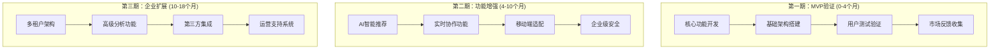
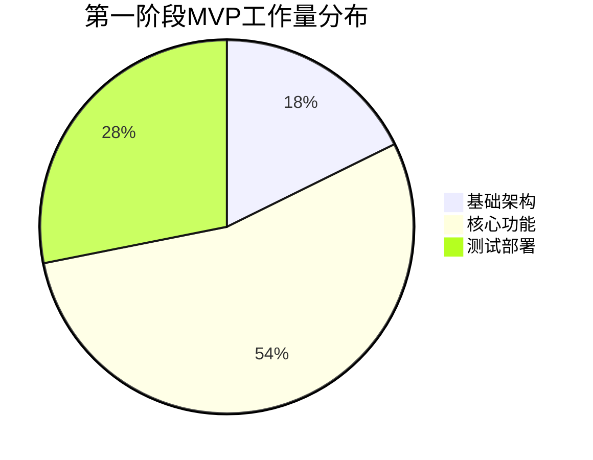

# PMO项目管理办公室产出 - 团建助手 (Project Management Office Output - Team Building Assistant)

**PMO项目管理专家输出文档**

## 1. PMO项目管理策略概述

### 1.1 角色定位与职责

PMO（项目管理办公室）负责团建助手项目的全面管理，包括项目规划、进度控制、资源协调、质量管理和风险控制，确保项目按计划交付，符合业务需求和预期收益。

### 1.2 项目管理方法论

采用**敏捷+瀑布混合模式**：
- **敏捷开发**：适用于产品功能迭代，快速响应用户需求变化
- **瀑布模式**：适用于基础设施搭建和核心架构设计
- **阶段性交付**：每个阶段都有明确的交付物和验收标准

## 2. 项目分期战略规划

### 2.1 三期项目划分

### 2.2 各期目标与成功标准

| 期别 | 时间周期 | 主要目标 | 成功标准 | 预期收益 |
|------|----------|----------|----------|----------|
| **第一期** | 0-4个月 | MVP功能验证 | 100+企业试用，NPS>30 | 验证产品市场契合度 |
| **第二期** | 4-10个月 | 产品功能完善 | 活跃用户500+，月留存>60% | 建立市场竞争优势 |
| **第三期** | 10-18个月 | 企业级解决方案 | 付费客户50+，ARR>$500K | 实现商业化盈利 |

## 3. 第一期MVP详细规划

### 3.1 MVP核心价值主张

**MVP定义**：最小可行产品，具备解决用户核心痛点的基本功能，可以快速上线验证市场需求。

**MVP目标**：
1. 验证团建活动规划的基本需求
2. 测试基本用户流程的可用性
3. 收集早期用户反馈
4. 为后续迭代提供数据支持

### 3.2 MVP功能范围界定

#### 3.2.1 **包含功能** (Must Have)

1. ✅ **基础活动管理**
   - 活动创建/编辑/删除
   - 基本信息设置（标题、时间、地点、参与人数）
   - 活动状态管理（草稿、进行中、已完成）

2. ✅ **团队基础管理**
   - 团队成员添加/移除
   - 团队成员参与状态跟踪
   - 团队基本信息管理

3. ✅ **基础AI活动推荐**
   - 基于简单规则的活动推荐（3-5个选项）
   - 活动类型分类筛选
   - 基础活动详情展示

4. ✅ **基础时间协调**
   - 简单的日期选择功能
   - 基础冲突显示
   - 团队成员可用性收集

5. ✅ **基础用户认证**
   - 用户注册/登录
   - 简单权限管理（普通用户/管理员）
   - JWT基础认证

#### 3.2.2 **延后功能** (Nice to Have for Later)

- 复杂AI算法和个性化推荐
- 实时协作编辑
- 高级数据分析
- 移动端PWA支持
- 复杂企业权限管理
- 高级安全特性

## 4. 第一期MVP详细工作安排

### 4.1 工作分解结构 (WBS)

#### 4.1.1 第一阶段：基础架构（0-1个月）

| 任务编号 | 任务描述 | 负责人 | 工时 | 依赖 |
|----------|----------|--------|------|------|
|T1.1 |基础数据库设计|DBA|40h|无|
|T1.2 |后端API框架搭建|后端|32h|无|
|T1.3 |前端项目初始化|前端|16h|无|
|T1.4 |用户认证基础模块|后端|24h|T1.2|
|T1.5 |基础部署脚本开发|OPS|24h|T1.3|
| **小计** | | | **136h** | |

#### 4.1.2 第二阶段：核心功能（1-3个月）

| 任务编号 | 任务描述 | 负责人 | 工时 | 依赖 |
|----------|----------|--------|------|------|
|T2.1 |活动管理API开发|后端|80h|T1.1,T1.2|
|T2.2 |团队成员管理功能|后端|64h|T2.1|
|T2.3 |基础推荐逻辑开发|后端|48h|T2.1|
|T2.4 |时间协调基础功能|后端|56h|T2.1|
|T2.5 |活动管理UI开发|前端|96h|T2.1|
|T2.6 |团队管理UI开发|前端|72h|T2.2|
|T2.7 |推荐功能UI开发|前端|48h|T2.3|
|T2.8 |基础算法测试|QA|32h|T2.3|
| **小计** | | | **416h** | |

#### 4.1.3 第三阶段：集成测试（3-4个月）

| 任务编号 | 任务描述 | 负责人 | 工时 | 依赖 |
|----------|----------|--------|------|------|
|T3.1 |系统集成测试|QA|64h|所有开发任务|
|T3.2 |性能基础测试|QA|24h|T3.1|
|T3.3 |UI/UX可用性测试|QA|24h|T2.5,T2.6,T2.7|
|T3.4 |安全基础测试|QA|16h|T3.1|
|T3.5 |用户验收测试准备|QA|16h|T3.1|
|T3.6 |测试文档编写|QA|32h|所有测试任务|
|T3.7 |生产环境部署|OPS|40h|T3.6|
| **小计** | | | **216h** | |

### 4.2 详细工时估算

#### 4.2.1 按角色工作量分布

| 角色 | 总工时 | 占比 | 主要工作 |
|------|--------|------|----------|
| **后端开发** | 288h | 42% | 核心API开发、推荐算法 |
| **前端开发** | 216h | 32% | UI界面开发、用户交互 |
| **QA质量保证** | 176h | 26% | 测试设计、自动化测试 |
| **OPS运维** | 64h | 9% | 部署脚本、CI/CD配置 |
| **DBA数据库** | 24h | 4% | 数据库设计、性能优化 |
| **合计** | **768h** | **100%** | |

#### 4.2.2 按阶段工作量分布

#### 4.2.3 每月工作强度规划

**第1个月（阶段1）**
- 总工时：136h
- 平均每日：34h（约4-5人工作）
- 关键里程碑：基础架构完成，认证系统上线

**第2-3个月（阶段2）**
- 总工时：416h
- 平均每日：28h（约3-4人工作）
- 关键里程碑：核心功能开发，基础UI完成

**第4个月（阶段3）**
- 总工时：216h
- 平均每日：27h（约3-4人工作）
- 关键里程碑：测试完成，MVP发布上线

## 5. 质量进度里程碑 (Quality Gates)

### 5.1 月进度验收标准

#### 5.1.1 第1个月验收标准

| 验收项 | 验收标准 | 负责角色 | 验收方式 |
|--------|----------|----------|----------|
|基础设施|数据库迁移脚本可执行|DBA|执行+验证|
|后端框架|API文档覆盖基础接口|后端|文档检查|
|前端基础|组件库建立，基础布局|前端|代码审查|
|用户认证|注册/登录/登出流程走通|后端|功能测试|
|部署流程|DEV环境可一键部署|OPS|部署演练|

#### 5.1.2 第2-3个月验收标准

| 验收项 | 验收标准 | 负责角色 | 验收方式 |
|--------|----------|----------|----------|
|活动管理|增删改查功能完整|后端/API|接口测试|
|推荐系统|推荐功能可用，>3选项|后端|功能演示|
|用户体验|UI流程可用，无明显BUG|前端/QA|用户测试|
|代码质量|单元测试覆盖率>80%|QA|覆盖率报告|

#### 5.1.3 第4个月验收标准（最终MVP验收）

| 验收项 | 验收标准 | 负责角色 | 验收方式 |
|--------|----------|----------|----------|
|功能完整性|核心功能100%实现|QA|功能检查清单|
|性能达标|API响应<500ms|P.O.|性能测试报告|
|用户体验|6名用户可完成基础任务|设计师|用户测试录像|
|质量达标|关键缺陷=0|QA|缺陷跟踪报告|
|部署就绪|生产环境一键部署|OPS|部署演练|