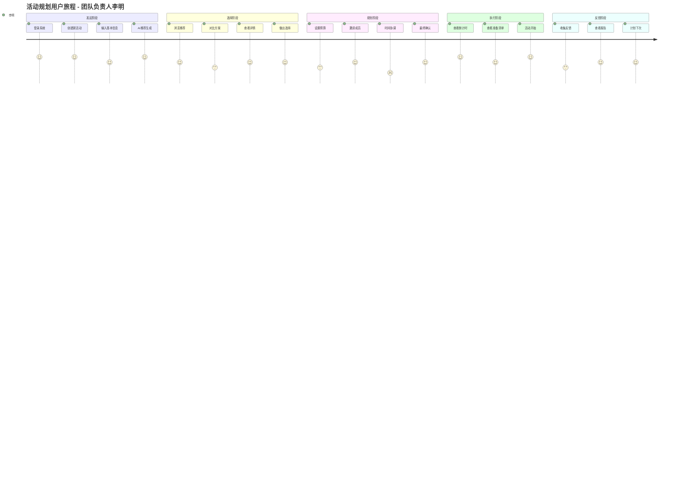

# 原型及交互设计 - 团建助手 (UX Prototypes & Interaction Design - Team Building Assistant)

**设计师输出文档**

## 1. 设计原则 (Design Principles)

### 1.1 核心设计原则
```
以用户为中心 (User-Centered)
└── 简化流程 (Simplify the Process)
    ├── 清晰的信息架构 (Clear Information Architecture)
    ├── 一致的用户体验 (Consistent UX)
    │   └── 企业级设计系统 (Enterprise Design System)
    └── 多终端适配 (Multi-device Adaptation)
```

### 1.2 设计目标
- **效率**: 30分钟内完成团建规划
- **直观**: 无需培训即可上手
- **愉悦**: 让团建规划本身成为乐趣
- **智能**: AI辅助决策，减少选择困难
- **包容**: 考虑到所有员工的需求和限制

### 1.3 设计语言 (Design Language)
- **色彩系统**: 基于企业蓝，搭配活力橙和平衡绿
- **字体系统**: 标题使用思源黑体，正文使用苹方
- **图标系统**: 线性图标，保持视觉一致性
- **动画**: 微交互动画，增强用户反馈

## 2. 用户旅程地图 (User Journey Map)

### 2.1 主要用户画像

#### 2.1.1 团队负责人 - 李明 (30岁)
- **特征**: 技术团队Leader，工作3年
- **目标**: 快速组织一次有效的团建活动
- **痛点**: 不懂活动策划，担心预算超支
- **场景**: 季度团建，30人团队

#### 2.1.2 HR专员 - 王芳 (28岁)
- **特征**: HR BP，负责文化建设
- **目标**: 统筹管理全公司团建
- **痛点**: 多部门协调困难，数据收集复杂
- **场景**: 年度团建规划，数据分析

#### 2.1.3 普通员工 - 张伟 (26岁)
- **特征**: 普通员工
- **目标**: 参与感兴趣的团建活动
- **痛点**: 时间冲突，活动内容不感兴趣
- **场景**: 查看团建安排，反馈评价

### 2.2 用户旅程 - 团队负责人



### 2.3 痛点分析

| 阶段 | 痛点 | 设计解决方案 |
|------|------|-------------|
| 发起 | 不知道如何开始 | 智能推荐模板 |
| 选择 | 信息太多无法决策 | AI个性化推荐 |
| 规划 | 协调困难 | 自动化协调工具 |
| 执行 | 担心现场问题 | 实时支持系统 |
| 结案 | 结果难评估 | 数据化报告 |

## 3. 信息架构 (Information Architecture)

### 3.1 导航系统
```
团建助手系统
├── 工作台 (Dashboard)
│   ├── 近期活动预告卡片
│   ├── 快速创建按钮
│   ├── 数据统计概览
│   └── 重要待办事项
├── 活动管理 (Activity Management)
│   ├── 活动列表
│   │   ├── 本周活动 (Week)
│   │   ├── 计划活动 (Planned)
│   │   ├── 历史活动 (History)
│   │   └── 我的收藏 (Favorites)
│   ├── 创建新活动 (Create Activity)
│   │   ├── AI智能推荐 (AI Recommendation)
│   │   ├── 模板创建 (From Template)
│   │   └── 自定义创建 (Custom Creation)
│   └── 活动详情 (Activity Details)
│       ├── 活动概览 (Overview)
│       ├── 成员管理 (Members)
│       ├── 预算控制 (Budget)
│       ├── 时间安排 (Schedule)
│       └── 反馈收集 (Feedback)
├── 团队管理 (Team Management)
│   ├── 团队列表
│   ├── 成员管理
│   └── 分组工具
├── 数据分析 (Analytics)
│   ├── 活动分析
│   ├── 预算分析
│   └── 满意度分析
└── 设置 (Settings)
    ├── 个人设置
    ├── 团队设置
    └── 系统设置
```

### 3.2 操作路径优化

#### 场景1: 快速创建一次团建
```
工作台 → 快速创建 → 输入基本信息 → AI推荐 →
选择方案 → 一键创建 → 编辑详情 → 发布通知
(预计耗时: 15分钟)
```

#### 场景2: 管理现有活动
```
活动列表 → 选择活动 → 活动详情 →
执行所需操作 → 查看更改结果
(预计耗时: 5-10分钟)
```

## 4. 界面原型设计 (Interface Prototype Design)

### 4.1 工作台 (Dashboard) - 设计稿

#### 4.1.1 视觉布局
```
┌─────────────────────────────────────────────────────────┐
│ 顶部导航: [Logo] 团建助手        [搜索] [通知] [用户头像] │
├─────────────────────────────────────────────────────────┤
│                                                         │
│     工作台                    快速创建                 │
│                                                         │
│  ┌─────────────┐  ┌─────────────┐  ┌─────────────┐    │
│  │ 即将开始    │  │ 本周统计    │  │ 月度预算    │    │
│  │             │  │             │  │             │    │
│  │ 京郊徒步    │  │ 活动: 3     │  │ 已用: 45k   │    │
│  │ 明天 09:00  │  │ 参与: 89    │  │ 预算: 100k  │    │
│  │             │  │ 满意度: 4.5 │  │ 剩余: 55k   │    │
│  └─────────────┘  └─────────────┘  └─────────────┘    │
│                                                         │
│  ┌──────────────────────────────────────────────────┐   │
│  │ 最近活动                                         │   │
│  │ ┌──────────────────────────────────────────────┐ │   │
│  │ │ 密室逃脱  [待评分]  2024-01-15    30人⭐⭐⭐⭐│ │   │
│  │ │ 滑雪团建  [已完成]  2024-01-01    25人⭐⭐⭐⭐☆│ │   │
│  │ │ 年终聚餐  [已完成]  2023-12-25    50人⭐⭐⭐⭐⭐│ │   │
│  │ └──────────────────────────────────────────────┘ │   │
│  └──────────────────────────────────────────────────┘   │
│                                                         │
│  查看更多 →                                             │
└─────────────────────────────────────────────────────────┘
```

#### 4.1.2 交互说明
- **卡片悬停**: 显示更多操作按钮 (编辑/删除)
- **点击活动**: 进入详情页
- **导航高亮**: 当前页面高亮显示
- **响应式布局**: 移动端自动调整为单列

### 4.2 活动创建流程 (Activity Creation Flow)

#### 步骤1: 基本信息输入
```
┌─────────────────────────────────────────────────────────┐
│ 创建新活动                    返回                      │
├─────────────────────────────────────────────────────────┤
│                                                         │
│ 活动基本信息                                            │
│                                                         │
│ 活动名称 [*]                                            │
│ ┌──────────────────────────────────────────────────┐   │
│ │                                                   │   │
│ └──────────────────────────────────────────────────┘   │
│                                                         │
│ 参与人数 [*]                                             │
│ ┌──────────────────────────────────────────────────┐   │
│ │  [ 20 ]  人                                        │   │
│ └──────────────────────────────────────────────────┘   │
│                                                         │
│ 预算范围 [*]                                             │
│ ┌───────────────┐ ～ ┌───────────────┐              │   │
│ │  10000 元      │    │  30000 元      │              │   │
│ └───────────────┘    └───────────────┘              │   │
│                                                         │
│ 活动类型                                                │
│                                                         │
│ ○ 户外运动  ○ 室内游戏  ○ 文化体验  ○ 技能培训       │   │
│ ○ 公益志愿  ○ 聚餐交流  ○ 其他                          │   │
│                                                         │
│ 特殊需求                                             │
│                                                         │
│ ┌──────────────────────────────────────────────────┐   │
│ │ 不支持户外运动 | 需要无障碍设施 | 其他...          │   │
│ └──────────────────────────────────────────────────┘   │
│                                                         │
│                          下一步 →                       │
└─────────────────────────────────────────────────────────┘
```

#### 步骤2: AI推荐展示
```
┌─────────────────────────────────────────────────────────┐
│ AI智能推荐                                               │
├─────────────────────────────────────────────────────────┤
│                                                         │
│ 根据您的需求，为您推荐以下活动：                         │
│                                                         │
│ 💡 推荐理由: 30人的中型团建，预算适中，推荐户外拓展   │   │
│                                                         │
│ ┌──────────────────────────────────────────────────┐   │
│ │ 🏔️ 推荐一: 京郊徒步穿越                               │ │   │
│ │                                                  │ │   │
│ │ 📍 门头沟灵山    ⏱️ 1天   💰 200/人             │ │   │
│ │ ⭐ 难度: ★★☆   🎯 团队凝聚力 ★★★★★             │ │   │
│ │                                                  │ │   │
│ │ "挑战自我，团队协作"                               │ │   │
│ │                                                  │ │   │
│ │ [查看详情] [收藏] [直接使用]                     │ │   │
│ └──────────────────────────────────────────────────┘   │
│                                                         │
│ ┌──────────────────────────────────────────────────┐   │
│ │ 🚣 推荐二: 皮划艇团队竞技                            │ │   │
│ │                                                  │ │   │
│ │ 📍 奥林匹克水上公园  ⏱️ 半天  💰 180/人        │ │   │
│ │ ⭐ 难度: ★★☆   🎯 沟通协作 ★★★★★             │ │   │
│ │                                                  │ │   │
│ │ "节奏配合，默契培养"                               │ │   │
│ │                                                  │ │   │
│ │ [查看详情] [收藏] [直接使用]                     │ │   │
│ └──────────────────────────────────────────────────┘   │
│                                                         │
│ ┌──────────────────────────────────────────────────┐   │
│ │ 🎯 推荐三: 真人CS团队对战                           │ │   │
│ │                                                  │ │   │
│ │ 📍 特种兵基地    ⏱️ 半天   💰 160/人             │ │   │
│ │ ⭐ 难度: ★★★   🎯 策略协作 ★★★★☆             │ │   │
│ │                                                  │ │   │
│ │ "战术配合，领导协作"                               │ │   │
│ │                                                  │ │   │
│ │ [查看详情] [收藏] [直接使用]                     │ │   │
│ └──────────────────────────────────────────────────┘   │
│                                                         │
│ ← 上一步                                               │
└─────────────────────────────────────────────────────────┘
```

### 4.3 活动详情页 (Activity Details)

```
┌─────────────────────────────────────────────────────────┐
│ 京郊徒步穿越                编辑    分享    更多       │
├─────────────────────────────────────────────────────────┤
│                                                         │
│ 状态: [进行中]  预算: ¥20,000 / ¥25,000      | [结项] │   │
│                                                         │
│ [概览] [成员] [预算] [日程] [反馈] [相册] [设置]      │   │
│ ──────────────────────────────────────────────────     │   │
│                                                         │
│                                                         │
│ 📊 活动概览                                            │
│                                                         │
│ ┌──────────────────────────────────────────────────┐   │
│ │ 原计划: 25人                          实到: 30人  │ │   │
│ │ 满意度: ⭐⭐⭐⭐☆ 4.5/5.0                   │ │   │
│ │ 预算使用率: 80%                         │ │   │
│ │ 平均完成时间: 4.2小时                  │ │   │
│ └──────────────────────────────────────────────────┘   │
│                                                         │
│ 📍 活动地点                                             │
│                                                         │
│ ┌──────────────────────────────────────────────────┐   │
│ │ 🗺️ 门头沟灵山自然风景区                           │ │   │
│ │ 点击查看详细地图                                   │ │   │
│ └──────────────────────────────────────────────────┘   │
│                                                         │
│ ⏰ 时间安排                                             │
│                                                         │
│ ┌──────────────────────────────────────────────────┐   │
│ │ 2024-01-20 (周六)                                │ │   │
│ │ 08:30 - 集合出发                                 │ │   │
│ │ 10:00 - 到达起点                                 │ │   │
│ │ 10:30 - 开始徒步                                 │ │   │
│ │ 12:00 - 午餐休息                                 │ │   │
│ │ 16:00 - 活动结束                                 │ │   │
│ │ 18:00 - 返回市区                                 │ │   │
│ └──────────────────────────────────────────────────┘   │
│                                                         │
│ 📋 准备清单                                            │   │
│                                                         │
│ ┌──────────────────────────────────────────────────┐   │
│ │ ✅ 运动鞋    ✅ 舒适衣物   ✅ 防晒用品           │ │   │
│ │ ✅ 登山杖    ✅ 双肩包     ✅ 保温杯             │ │   │
│ │ ✅ 个人药品  ✅ 充电宝     ✅ 午餐干粮           │ │   │
│ └──────────────────────────────────────────────────┘   │
│                                                         │
│ 最近更新: 李明 2024-01-18 14:23                       │   │
└─────────────────────────────────────────────────────────┘
```

## 5. 关键交互流程设计 (Key Interaction Flow)

### 5.1 时间协调交互流程

#### 5.1.1 时间视图设计
```
┌─────────────────────────────────────────────────────────┐
│ 时间协调                 ← 返回                         │
├─────────────────────────────────────────────────────────┤
│                                                         │
│ 活动时间: [点击选择]                                   │
│                                                         │
│ 📅 1月第3周时间协调                                     │   │
│                                                         │
│ 星期一    星期二    星期三    星期四    星期五    周末   │   │
│ ┌────┐   ┌────┐   ┌────┐   ┌────┐   ┌────┐           │   │
│ │15│   │16│   │17│   │18│   │19│                          │   │
│ │✅│   │✅│   │✅│   │✅│   │❌│   20 ✘                     │   │
│ │85│   │90│   │80│   │95│   │30│   21 ✔                    │   │
│ └────┘   └────┘   └────┘   └────┘   └────┘   88%         │   │
│                                                         │   │
│ ┌──────────────────────────────────────────────────┐   │
│ │ 最佳时间: 1月18日 周四 14:00-17:00 (95%可参加)    │ │   │
│ │ [使用此时间]                                     │ │   │
│ └──────────────────────────────────────────────────┘   │
│                                                         │
│ 时段选择:                                               │   │
│ ○ 上午(9:00-12:00)  ○ 下午(14:00-17:00)  ○ 全天       │   │
│                                                         │
│ 成员反馈统计:                                           │   │
│ 📊 已填写: 28/30 (93%)                                  │   │
│ 🤔 有冲突: 2人                                          │   │
│ 💬 建议累计: 15条                                       │   │
│                                                         │
│ ┌──────────────────────────────────────────────────┐   │
│ │ 冲突成员列表:                                     │ │   │
│ │ • 张三: 19号要出差 → 建议改20日                   │ │   │
│ │ • 李四: 周四下午有会 → 建议改上午                  │ │   │
│ │ [查看详细]                                        │ │   │
│ └──────────────────────────────────────────────────┘   │
│                                                         │
│                           确定时间 →                    │   │
└─────────────────────────────────────────────────────────┘
```

### 5.2 实时协作功能

#### 5.2.1 协同编辑状态
```
┌─────────────────────────────────────────────────────────┐
│ 活动须知编辑中...                                       │
│ ┌──────────────────────────────────────────────────┐   │
│ │ 团队协作，挑战自我！🎉                             │ │   │
│ │                                                  │ │   │
│ │ 活动目标:                                       │ │   │
│ │ • 增强团队凝聚力                                 │ │   │
│ │ • 提升沟通能力                                   │ │   │
│ │ • 挑战个人极限                                   │ │   │
│ │                                                  │ │   │
│ │ 💡 新建议: 张一山正在输入...                      │ │   │
│ │ 💡 已采纳: 王芳 @ 2分钟前                          │ │   │
│ └──────────────────────────────────────────────────┘   │
│                                                         │
│ 在线编辑者:[李明]🟢 [王芳]🟢 [张伟]🟢               │   │
└─────────────────────────────────────────────────────────┘
```

## 6. 移动端适配设计 (Mobile Adaptation)

### 6.1 响应式设计断点
- **超小屏 (xs)**: < 576px - 手机竖屏
- **小屏 (sm)**: ≥ 576px - 手机横屏
- **中屏 (md)**: ≥ 768px - 平板
- **大屏 (lg)**: ≥ 992px - 小屏笔记本
- **超大屏 (xl)**: ≥ 1200px - 大屏显示器

### 6.2 移动端交互优化

#### 6.2.1 底部导航栏
```
┌─────────────────────────────────────────────────────────┐
│                                                         │
│                    主内容区域                           │
│                                                         │
│                                                         │
│                                                         │
│                                                         │
│                                                         │
│                                                         │
├─────────────────────────────────────────────────────────┤
│  🏠  工作台  │  🎯  活动  │  📊  数据  │  👤  我的      │
└─────────────────────────────────────────────────────────┘
```

#### 6.2.2 手势操作
- **下拉刷新**: 活动列表页面
- **右滑返回**: 详情页到列表页
- **长按菜单**: 快速操作菜单
- **双指缩放**: 图片浏览时

### 6.3 移动端特色功能
- **离线支持**: 缓存最近活动数据
- **通知推送**: 重要的状态变更
- **位置服务**: GPS签到、导航
- **相机集成**: 现场拍照上传
- **语音输入**: 不方便打字时使用

## 7. 无障碍设计 (Accessibility Design)

### 7.1 视觉无障碍
- **色彩对比**: 达到WCAG 2.1 AA标准
- **字体大小**: 支持系统字体缩放
- **高对比模式**: 黑白模式适配
- **色盲支持**: 提供图案辅助识别

### 7.2 操作无障碍
- **键盘导航**: 全流程支持Tab键
- **屏幕阅读器**: ARIA标签完整
- **简短操作**: 最少点击次数
- **纠错机制**: 操作撤销/重做

### 7.3 认知无障碍
- **简化语言**: 避免专业术语
- **步骤引导**: 清晰的操作提示
- **确认反馈**: 每个操作都有反馈
- **帮助文档**: 常见问题解答

## 8. 视觉设计规范 (Visual Design System)

### 8.1 色彩系统 (Color System)

#### 8.1.1 主色调
```css
主色 (Primary): #096DD9
├── 浅色 (Light-6): #B7E3FF
├── 基础 (Base): #096DD9
└── 深色 (Dark-6): #003A8C

辅助色 (Secondary): #FA8C16
└── 语义色:
    ├── 成功 (Success): #52C41A
    ├── 警告 (Warning): #FAAD14
    ├── 错误 (Error): #F5222D
    └── 信息 (Info): #1890FF
```

#### 8.1.2 中性色
```css
文字色:
├── 标题: #262626
├── 正文: #595959
├── 次要: #8C8C8C
└── 禁用: #BFBFBF

背景色:
├── 浅灰: #FAFAFA
├── 中灰: #F5F5F5
└── 深灰: #E8E8E8
```

### 8.2 字体系统 (Typography System)
```css
字体大小层级:
├── H1: 32px / 40px - 页面标题
├── H2: 24px / 32px - 模块标题
├── H3: 20px / 28px - 区块标题
├── H4: 16px / 24px - 小标题
├── Body: 14px / 22px - 正文
├── Caption: 12px / 20px - 说明文字
└── Small: 10px / 18px - 细微文字
```

### 8.3 间距系统 (Spacing System)
```css
间距标准 (基于4px的8点栅格系统):
├── xs: 4px
├── sm: 8px
├── md: 16px
├── lg: 24px
├── xl: 32px
├── 2xl: 48px
└── 3xl: 64px
```

### 8.4 圆角系统 (Border Radius)
```css
圆角标准:
├── 无: 0px - 表格、输入框
├── 小: 4px - 卡片、按钮
├── 中: 8px - 部件外壳
├── 大: 12px - 弹窗、大卡片
└── 全圆: 50% - 头像、圆形按钮
```

## 9. 微交互设计 (Micro-Interaction Design)

### 9.1 状态变化动画
- **悬停**: 0.2s ease-out
- **点击**: 0.1s ease-in
- **加载**: 旋转动画
- **成功**: 绿色勾选动画
- **错误**: 红色抖动动画

### 9.2 系统反馈设计

#### 9.2.1 Toast消息
```
┌─────────────────────────────────────────────────────────┐
│ ✅ 操作成功！活动"密室逃脱"已创建                     X │
└─────────────────────────────────────────────────────────┘
```

#### 9.2.2 加载状态
```
┌─────────────────────────────────────────────────────────┐
│                                                         │
│                ⟳ 正在为您推荐活动...                    │
│                                                         │
│              根据团队特点智能生成方案                   │
│                                                         │
└─────────────────────────────────────────────────────────┘
```

## 10. 原型工具交付 (Prototype Deliverables)

### 10.1 原型交付物清单
- [ ] 低保真线框图 (所有核心页面)
- [ ] 高保真原型 (关键交互流程)
- [ ] 交互说明文档
- [ ] 切图资源包
- [ ] 设计规范文档
- [ ] 动效原型视频

### 10.2 开发交接规范
```yaml
开发交接内容:
  - 设计稿标注: Zeplin/Figma链接
  - CSS变量定义: 包含所有色彩、间距
  - 组件说明: 交互状态和响应式规则
  - 切图资源: SVG/PNG多种格式
  - 动效参数: 时间、缓动函数
```

### 10.3 验收检查清单
- [ ] 所有页面的视觉一致性
- [ ] 交互流程完整性测试
- [ ] 响应式布局验证
- [ ] 无障碍设计检查
- [ ] 加载性能优化
- [ ] 浏览器兼容性测试

## 11. 总结 (Summary)

通过系统化的UX设计过程，我们为团建助手创造了一个：

1. **以用户为中心**: 三类核心用户的痛点都得到了解决
2. **高效易用**: 核心任务30分钟内可完成
3. **视觉统一**: 完整的企业级设计系统
4. **无障碍支持**: WCAG 2.1 AA标准
5. **全设备适配**: 从手机到桌面端到端体验

**设计亮点**:
- AI推荐降低决策难度
- 可视化时间协调工具
- 实时协作支持
- 数据驱动的决策支持界面
- 全面的无障碍设计

**下一步**: 前端工程师将基于这些设计稿和交互规范，开发具体的前端实现。\n\n---
\n**生成日期**: 2024年\n**设计师**: [虚拟角色输出]\n**评审状态**: 待前端工程师实现